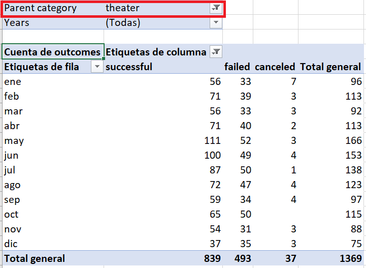
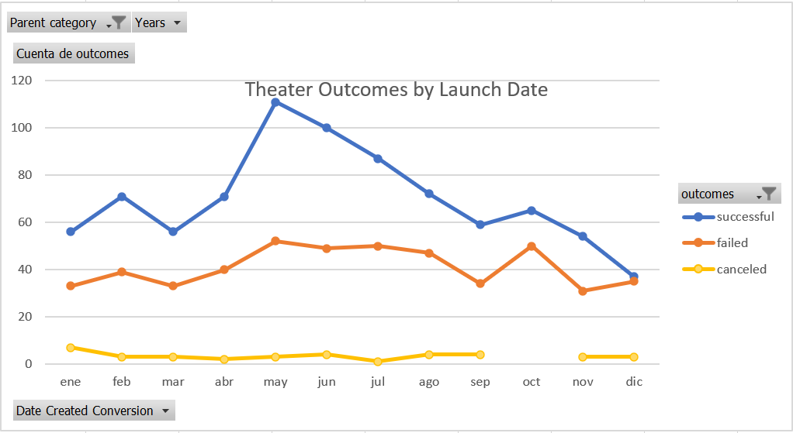

# Kickstarting with Excel

## Overview of Project
Louise needs to know how different campaigns are related to their launch dates and their fundings goals because her play Fever came close to its fundraising goal in a short amount of time. For this reason, we will organize, sort, and analyze the Kickstarter dataset to get insights so we can equate the Fever campaign with other successful ones in the same category. With our analysis, we will help Louis plan her play Fever and set it up for success.

### Purpose
We will visualize and analyze campaign outcomes of the Kicktarter dataset based on their launch dates and their based goals. 

## Analysis and Challenges

### Analysis of Outcomes Based on Launch Date

The beginning of the analysis of outcomes based on launch date is the adjustment of the Kickstarter dataset with the including "Year" column through the Excel YEAR() function applied to the derived column "Date Created Conversion." In our analysis, the column "Year" is the alternative filter in the dataset visualization.

The next step is the pivot table creation from the Kickstarter worksheet with the columns "Year" and "Parent Category" as filters, the "outcomes" as the column, the "Date Created Conversion" as rows, and, again, outcomes as values but configured as count field.

 

In the pivot table, we use the "Parent category" filter with the "theater" option to get the category campaigns related to plays. The total general results are 839 successful campaigns, 493 failed, and 37 canceled, according to the dataset period from May 2009 to March 2017.

Finally, we can visualize the relationship between outcomes and the launch month from the pivot table with a line dynamic chart with markers. At a glance, we can see that there are more successful theater campaigns than failed and canceled.

### Analysis of Outcomes Based on Goals

The analysis of outcomes based on goals is sustained in the visualization of the percentage of successful, failed, and canceled plays related to the funding goal amount. Therefore, we need to organize the funding goal of projects in dollar-amount ranks, and so we can group them for the analysis. The dollars-amounts established are shown in the following image.

 

Due to the Kickstarter dataset structure, we need to collect the outcome and goal data for the “plays” subcategory through the Excel COUNTIFS() function. With the collection of goal data for every outcome, we can calculate the percentage of successful, failed, and canceled plays. 

We populate the "Total Projects" column with the help of the Excel SUM() function, which adds up the number of successful, failed, and canceled projects for each row. In this way, now the percentage of the outcomes based on Goals is possible to calculate. The percentage value for every Outcome is calculated based on the "Total Projects" amount for every row: (value/Total Projects) * 100%

 

Finally, we can visualize the Outcomes-based on Goals with a line chart with the selection of the columns: Goal, Percentage Successful, Percentage Failed, Percentage Canceled. At a glance, we can see that projects with less than USD 1,000.00 of goal are likely successful, while the projects with dollar-amount from USD 45,000.00 to $49,000.00 are most susceptible to failure 

### Challenges and Difficulties Encountered

I encountered some difficulties making the Outcomes Based on Goals analysis due to the COUNTIFS function settings for every row to calculate the number of successful, failed, and canceled projects. In such a case, I think VBA is the best option to calculate the outcomes based on goals.  

## Results

- What are two conclusions you can draw about the Outcomes based on Launch Date?
    - On average, 56% of the projects are successful when their launch date is into the three first quarters per year. The period from May to July is when projects are launching most.
    - The number of projects launched decrease in the last quarter. However, December is when the projects likely fail.  The projects canceled remain over the year, but they are not a significant number.  
- What can you conclude about the Outcomes based on Goals?
    - In the beginning, Louis estimated a $10,000 USD budget for her Fever play

- What are some limitations of this dataset?

- What are some other possible tables and/or graphs that we could create?
